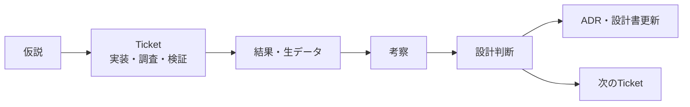
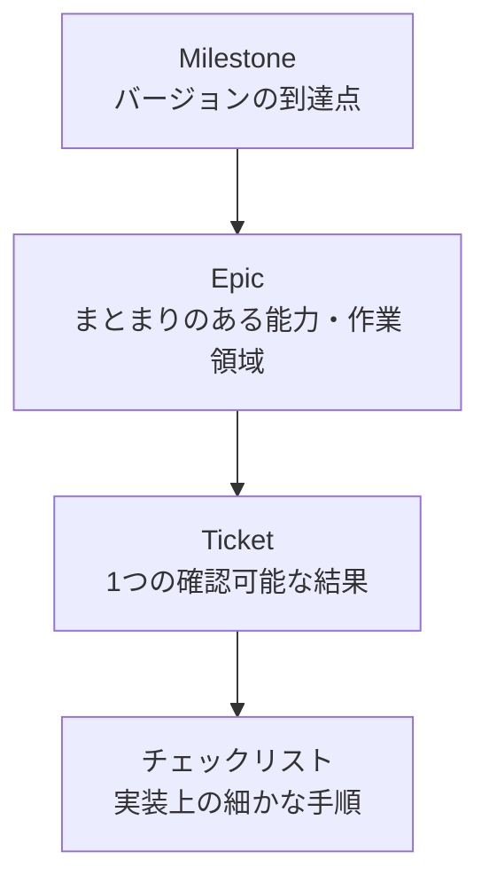

---
aliases:
  - RAGScopeプロジェクト管理規約
  - RAGScopeチケット運用規約
tags:
  - ragscope
  - obsidian
  - project-management
note_type: reference
status: stable
---
# RAGScope — Obsidianプロジェクト管理規約

> [!abstract] このノートの役割
> RAGScopeの開発作業を、Obsidian上で**Milestone → Epic → Ticket**の3層に分解し、実装・調査・検証・設計判断を一貫した方法で管理する。  
> 本規約は作業管理の方法を定義し、プロダクトの仕様やバージョンごとの成功条件は[[ragscope-design|RAGScope設計書]]に従う。

## 1. 適用範囲と参照順序

RAGScope関連の作業管理ノートを作成・更新するときは、次の順序で参照する。

1. [[ragscope-design|RAGScope設計書]]
   - プロジェクトの目的、対象・対象外、バージョン計画、成功条件を定義する。
2. [[obsidian-metadata-rules|Obsidianメタデータ規約]]
   - Frontmatter、`note_type`、`status`、`tags`などの使用方法を定義する。
3. 本規約
   - Milestone、Epic、Ticketへの分解方法と、日々の運用方法を定義する。

> [!important] 優先順位
> 本規約と設計書が矛盾する場合は設計書を優先する。  
> 本規約とメタデータ規約が矛盾する場合はメタデータ規約を優先し、独断で新しいプロパティを追加しない。

## 2. 基本原則

### 2.1 小さな完成を積み上げる

- 現在のバージョンの成功条件を満たすことを優先する。
- 将来のバージョンで必要な機能を、先回りして現在のTicketへ混ぜない。
- v1.0までの全作業を最初から詳細化しない。
- 現在のMilestoneは具体的に、次のMilestoneは粗く、それ以降は[[ragscope-design#10.2 バージョン別計画|設計書のロードマップ]]だけで管理する。

### 2.2 1 Ticket、1つの確認可能な結果

Ticketは、完了時に次の形式で結果を確認できる単位にする。

- コマンドを実行できる
- APIが期待したレスポンスを返す
- データが保存・取得できる
- テストが通る
- 調査結果から設計判断を下せる
- 文書が更新され、第三者が手順を再現できる

「Aを実装し、Bを設計し、Cも調査する」のように複数の独立した結果を含む場合は分割する。

### 2.3 Ticket管理を仕事にしない

- 関数1個、ファイル1個の作成だけを原則としてTicketにしない。
- Ticketを完了するための細かな手順は、そのTicket内のチェックリストにする。
- 実装中に新しい作業が見つかった場合、現在の目的に必要ならチェックリストへ追加し、独立した成果なら新しいTicket候補として記録する。

### 2.4 実装だけでなく判断過程を残す

RAGScopeでは、実装結果だけでなく、次の流れを追跡できるようにする。



## 3. 3層構造



### 3.1 Milestone

Milestoneは、RAGScopeのバージョン単位とする。

例：

- `v0.0` — 固定文書のchunk化、Embedding生成・保存、exact search
- `v0.1` — 検索評価・比較基盤
- `v0.1.5` — AWSデプロイスパイク
- `v0.2` — 回答生成と引用
- `v0.3` — hybrid検索とreranking
- `v0.4` — 回答・引用・回答可能性評価
- `v0.5` — 堅牢化と運用性
- `v1.0` — 第三者が再現できるローカル公開版

Milestoneの範囲と成功条件は、必ず[[ragscope-design#10.2 バージョン別計画|設計書のバージョン別計画]]を起点にする。

> [!note] `v0.1.5`の扱い
> `v0.1.5`はRAG本体の直列的な機能追加ではなく、v0.1後に行う独立したAWS学習スパイクとして管理する。

### 3.2 Epic

Epicは、Milestoneを構成する**まとまりのある能力または作業領域**とする。

v0.0の例：

- 文書読み込み・正規化
- chunk分割
- Python AI Service
- Embedding生成
- PostgreSQL / pgvector
- Haskell CLI
- end-to-end検索
- テスト・ドキュメント

Epicの完了条件は、「関連Ticketがすべて終わった」だけでなく、利用者から見て何が可能になるかで記述する。

### 3.3 Ticket

Ticketは、Epicを進めるための最小の管理単位とする。

良い例：

- Pythonで1件のテキストからEmbeddingを生成できる
- Haskellから`POST /embeddings`を呼び出せる
- pgvectorへ固定vectorを保存し、exact searchできる
- Haskell CLIの質問に対して上位3件のchunkを表示できる
- M2 16GBで候補Embedding modelが動作するか検証し、採否を決める

大きすぎる例：

- Python AI Serviceを完成させる
- データベースを実装する
- RAGを作る

細かすぎる例：

- `Main.hs`を作成する
- 関数名を決める
- importを追加する

## 4. Obsidian上の配置

次のように、フォルダ階層自体でMilestoneとEpicを表現することを推奨する。

```text
project-management/
├── ragscope-project-dashboard.md
└── milestones/
    ├── v0.0/
    │   ├── v0.0.md
    │   ├── document-ingestion/
    │   │   ├── v0.0-document-ingestion.md
    │   │   ├── RS-0001-read-fixed-markdown.md
    │   │   └── RS-0002-normalize-document.md
    │   ├── embedding-service/
    │   │   ├── v0.0-embedding-service.md
    │   │   └── RS-0003-generate-single-embedding.md
    │   └── end-to-end-search/
    │       ├── v0.0-end-to-end-search.md
    │       └── RS-0010-show-top-chunks.md
    └── v0.1/
        └── v0.1.md
```

> [!tip] フォルダ名は固定ではない
> Vault全体の構成に合わせてルートパスは変更してよい。  
> ただし、Milestone → Epic → Ticketの親子関係がファイルパスから読み取れる構造を維持する。

## 5. 命名規則

### 5.1 Ticket ID

- Ticketにはプロジェクト全体で一意な連番を付ける。
- 形式は`RS-0001`とする。
- 完了・中止・移動後もIDを変更しない。
- 削除したIDを再利用しない。
- IDにMilestoneやEpicの情報を埋め込まない。

### 5.2 ファイル名

```text
RS-0001-read-fixed-markdown.md
RS-0002-normalize-document.md
RS-0003-generate-single-embedding.md
```

- IDの後ろは短い英語のkebab-caseとする。
- 日本語の説明は見出しまたは`aliases`に記載する。
- Ticket種別はファイル名へ含めず、見出しに記載する。

### 5.3 見出し

```markdown
# RS-0003 — [Feature] Pythonで1件のEmbeddingを生成する
```

Ticket種別は次から選ぶ。

| 種別 | 用途 |
|---|---|
| `[Feature]` | 新しい動作や能力を追加する |
| `[Fix]` | 不具合や設計との不整合を修正する |
| `[Spike]` | 不確実な技術・方式を小さく検証する |
| `[Design]` | API、データ構造、責務分担などを決定する |
| `[Test]` | 正常系・異常系・再現性を検証する |
| `[Docs]` | README、設計書、手順、既知の制約を整備する |

## 6. Frontmatterと状態管理

Frontmatterは[[obsidian-metadata-rules|Obsidianメタデータ規約]]に従い、未登録プロパティを追加しない。

### 6.1 使用するプロパティ

- `aliases`
- `tags`
- `note_type`
- `status`
- 必要な場合のみ`cssclasses`

次のようなプロジェクト管理用プロパティは、現時点では追加しない。

```yaml
milestone:
epic:
ticket_type:
priority:
blocked:
due_date:
```

MilestoneとEpicはファイルパスおよびWikiリンク、Ticket種別は見出し、作業順はMilestone / Epicノート内の並び順で表す。

> [!warning] 新しいプロパティが必要になった場合
> Basesや自動処理で明確な利用目的が生じた場合は、先に[[obsidian-metadata-rules#8. 新しいプロパティを追加する手順|メタデータ規約の追加手順]]に従って規約変更案を作る。個別Ticketだけに追加してはならない。

### 6.2 `status`の運用

Ticketノートでは、既存の`status`を次のように解釈する。

| `status` | Ticketの状態 | 運用 |
|---|---|---|
| `draft` | Backlog / 未着手 | 目的や完了条件を整理中、または着手待ち |
| `active` | In Progress | 現在作業中 |
| `stable` | Done | 完了条件を満たし、結果と検証内容を記録済み |
| `deprecated` | Superseded | 別Ticketや別判断によって置き換えられた |
| `archived` | Canceled | 実施しないと判断し、理由を記録した |

これはTicketノート自体の文書状態として、メタデータ規約の意味を保ったまま使用する。

> [!important] 完了判定
> `status: stable`へ変更できるのは、完了条件のチェックだけでなく、**検証結果と実施結果が本文へ記録された後**とする。

### 6.3 `note_type`の選択

Ticketだから一律に特別な`note_type`を追加するのではなく、ノートの内容に応じて既存値を使用する。

| Ticketの内容 | 推奨`note_type` |
|---|---|
| 実装・修正・テスト・ドキュメント作業 | `implementation` |
| 技術検証・比較実験 | `experiment` |
| 設計書 | `design` |
| 重要な設計判断 | `adr` |
| 規約・参照一覧 | `reference` |
| Milestone / Epicの入口 | `moc` |

## 7. Ticketの作成基準

### 7.1 Ticketとして独立させる条件

次のいずれかを満たす作業は、独立したTicketにする。

- 単独で完了確認できる成果がある
- 独立した調査結果や設計判断が必要である
- 失敗した場合に原因と結果を個別に追跡したい
- 別Ticketから依存される
- 後から実施時期やMilestoneを変更する可能性がある

### 7.2 チェックリストに留める条件

次の作業は、原則としてTicket内のチェックリストにする。

- 1つの成果を作るための実装手順
- 小さなリファクタリング
- import、ファイル作成、関数追加などの内部作業
- 同じ検証結果へ収束する複数の操作

### 7.3 分割の目安

次の場合はTicketを分割する。

- 完了条件が5〜7個を大きく超える
- 異なるコンポーネントの独立した成果を含む
- 調査と本実装を同時に扱っている
- 正常系実装と大規模な異常系対応が混在する
- Ticket名に「および」「さらに」「一式」が頻繁に現れる

## 8. Ticketテンプレート

```markdown
---
aliases:
  - 日本語でのTicket名
tags:
  - ragscope
note_type: implementation
status: draft
---
# RS-0001 — [Feature] Ticketの目的を動詞で記述する

> [!summary] このTicketで可能にすること
> 完了後に、利用者またはシステムが何をできるようになるかを1〜3文で記述する。

## コンテキスト

- Milestone: [[v0.0]]
- Epic: [[v0.0-document-ingestion]]
- 設計書: [[ragscope-design#12. v0.0 実装内容]]
- 対象コンポーネント: [[Haskell API・CLI]] / [[Python AI Service]] / [[PostgreSQL]]

## 目的

このTicketを実施する理由と、解消したい不確実性・不足している能力を記述する。

## 完了条件

- [ ] 外部から確認できる条件
- [ ] 正常系の実行例またはテストがある
- [ ] 必要な異常系を確認した
- [ ] 実施結果を本ノートへ記録した
- [ ] 必要な場合は設計書・ADR・READMEを更新した

## 対象外

- このTicketでは扱わない機能
- 後続バージョンへ回す内容

## 実装・調査メモ

作業中の観察、コマンド、設計上の論点を記録する。

## 検証

### 手順

1. 実行手順を記述する。
2. 入力条件を記述する。

### 期待結果

期待する動作を記述する。

### 実際の結果

実測した結果、出力、エラー、性能値などを記録する。

## 結果

> [!success] 完了時の要約
> 何が可能になったか、完了条件をどのように確認したかを記述する。

## 判断・後続作業

- 設計判断がある場合は[[ADR]]へ分離してリンクする。
- 独立した後続作業は新しいTicket候補として記録する。
- 今回実施しなかった理由も必要に応じて残す。

## 関連ノート

- [[関連するTicket]]
- [[関連する実験ノート]]
- [[関連するADR]]
```

> [!tip] テンプレートは削ってよい
> 小さなTicketでは不要な節を省略してよい。ただし、`目的`、`完了条件`、`対象外`、`検証または結果`は原則として残す。

## 9. 種別ごとの追加ルール

### 9.1 `[Feature]` / `[Fix]`

- 利用者または他コンポーネントから観察できる動作を書く。
- 実装方法ではなく、振る舞いを完了条件にする。
- 最低1つの実行例または自動テストを残す。

### 9.2 `[Spike]`

Spikeはコード完成ではなく、**不確実性を減らし判断できる状態**を完了とする。

必ず記載する項目：

- 調査したい問い
- 候補または仮説
- 検証条件
- 観察結果
- 採用・不採用・保留の結論
- 結論の適用範囲と制約

Spikeで作ったコードは、そのまま本実装へ採用する前に品質と責務を見直す。

### 9.3 `[Design]`

- 解決したい設計上の問題を明確にする。
- 選択肢を複数示す。
- 採用理由と不採用理由を残す。
- 長期的に重要な判断はADRとして分離する。

### 9.4 `[Test]`

- 対象、前提条件、入力、期待結果を明記する。
- 正常系と異常系を区別する。
- 再現できなかった場合も、その事実と条件を結果として残す。

### 9.5 `[Docs]`

- 読者を明確にする。
- 更新対象のノートをWikiリンクで示す。
- 記載した手順を実際に再実行して確認する。

## 10. Milestoneノート

Milestoneノートは、そのバージョンの作業入口となるMOCとして作成する。

```markdown
---
aliases:
  - RAGScope v0.0 Milestone
tags:
  - ragscope
note_type: moc
status: active
---
# RAGScope v0.0

> [!goal] 到達点
> [[ragscope-design#12. v0.0 実装内容|設計書のv0.0実装内容]]を、利用者が確認できる形で実現する。

## 成功条件

- [ ] 固定文書を固定ルールでchunk化できる
- [ ] PythonでEmbeddingを生成できる
- [ ] pgvectorへ保存できる
- [ ] Haskell CLIからexact searchできる
- [ ] 上位chunkを表示できる

## Epic

1. [[v0.0-document-ingestion]]
2. [[v0.0-embedding-service]]
3. [[v0.0-pgvector-search]]
4. [[v0.0-haskell-cli]]
5. [[v0.0-end-to-end-search]]

## 現在の作業

- [[RS-0001-read-fixed-markdown]]

## 完了したTicket

- 完了後に主要Ticketへのリンクを残す。

## 未解決事項

- 現在のMilestoneを妨げる論点だけを記載する。

## 完了レビュー

- 成功条件をどの実行結果で確認したか
- 設計書との差分
- 次のMilestoneへ持ち越す事項
- 新しく作成・更新したADR、実験、README
```

## 11. Epicノート

Epicノートは、関連Ticketと能力の完成条件をまとめるMOCとして作成する。

```markdown
---
aliases:
  - v0.0 文書取り込みEpic
tags:
  - ragscope
note_type: moc
status: active
---
# v0.0 — 文書取り込み

> [!goal] Epicの完了状態
> 少量の固定Markdown文書を読み込み、後続のchunk分割へ渡せる正規化済み本文を得られる。

## 対象

- [[ragscope-design#5.1 文書・評価データ・質問処理の流れ]]

## Ticket

### Draft

- [[RS-0002-normalize-document]]

### Active

- [[RS-0001-read-fixed-markdown]]

### Stable

- 完了したTicketを移動する。

## Epic完了条件

- [ ] Epicとして利用可能な能力を確認した
- [ ] 必要なTicketが`stable`である
- [ ] 設計書との差分を反映した
- [ ] 未完了作業の移動先を明確にした
```

Epicノート内のTicket一覧は、作業順と見通しを表す。Ticketの正式な状態は各Ticketノートの`status`とし、一覧との不整合を見つけた場合は修正する。

## 12. 作業フロー

### 12.1 Milestone開始時

1. 設計書の対象範囲と成功条件を確認する。
2. Milestoneノートを作成する。
3. 成功条件を能力単位のEpicへ分解する。
4. 最初に必要なTicketだけを作成する。
5. 未決定事項は、実装に必要になった時点で`[Spike]`または`[Design]`として作成する。

### 12.2 Ticket着手時

1. `目的`、`完了条件`、`対象外`を確認する。
2. 依存Ticketが満たされているか確認する。
3. `status`を`draft`から`active`へ変更する。
4. Milestoneノートの`現在の作業`へリンクする。

> [!important] WIP制限
> 原則として、同時に`active`にする主要Ticketは1件とする。  
> 外部要因で進められない場合に限り、理由をTicket本文へ記録したうえで別Ticketへ着手する。

### 12.3 作業中

- 実装上の発見、失敗、コマンド、検証結果をTicketへ追記する。
- スコープ外の改善を現在のTicketへ混ぜない。
- 独立した成果が必要なら後続Ticket候補として記録する。
- 設計書と矛盾を発見した場合、実装で隠さず、設計書更新またはADRの必要性を記録する。

作業が中断している場合は、`status: active`のまま次のようなcalloutを置く。

```markdown
> [!warning] Blocked
> ブロックしている理由、解除条件、関連Ticketを記載する。
```

`blocked`プロパティは追加しない。

### 12.4 Ticket完了時

1. 完了条件をすべて確認する。
2. 検証手順と実際の結果を記録する。
3. 必要なテスト、設計書、ADR、READMEを更新する。
4. 後続Ticketを作成または候補として記録する。
5. `status`を`stable`へ変更する。
6. Epic / Milestoneノートの一覧を更新する。

### 12.5 Milestone完了時

Milestoneは、Ticket数ではなく設計書の成功条件で判定する。

- 設計書の成功条件を実行結果で確認した
- 必須Epicが完了した
- 失敗例と既知の制約を記録した
- 設計書と実装の差分を解消した
- 重要な設計判断をADRへ残した
- 次のMilestoneへ持ち越す作業を明示した

すべて満たした後、Milestoneノートの`status`を`stable`へ変更する。

## 13. 設計書・ADR・実験ノートとの境界

| 情報                     | 記載先                           |
| ---------------------- | ----------------------------- |
| バージョンの対象・対象外・成功条件      | [[ragscope-design]]           |
| 作業の目的、完了条件、実施メモ、検証結果   | Ticket                        |
| 複数案から選んだ重要な設計判断        | ADR                           |
| モデルや方式の比較条件、生データ、結果、考察 | `note_type: experiment`の実験ノート |
| 一般的なAI・LLM・RAG知識       | [[ai-llm-rag-notes]]          |
| Frontmatterとタグの規則      | [[obsidian-metadata-rules]]   |

> [!important] Ticketを仕様書にしない
> Ticketは作業と結果の記録であり、長期的な仕様の唯一の保存先にしない。  
> 完了後も有効な設計情報は、設計書またはADRへ反映する。

## 14. Basesによるダッシュボード

Obsidianのコアプラグイン`Bases`を使う場合、TicketノートのデータはMarkdownと既存プロパティのまま管理する。

次は例であり、`file.inFolder`のパスはVault構成に合わせて変更する。

````markdown
```base
filters:
  and:
    - file.inFolder("project-management/milestones")
    - 'note_type != "moc"'
properties:
  file.name:
    displayName: Ticket
  status:
    displayName: Status
  note_type:
    displayName: Note Type
views:
  - type: table
    name: All Tickets
    groupBy:
      property: status
      direction: ASC
    order:
      - file.name
      - status
      - note_type
  - type: table
    name: Active
    filters:
      and:
        - 'status == "active"'
    order:
      - file.name
      - note_type
  - type: table
    name: Draft
    filters:
      and:
        - 'status == "draft"'
    order:
      - file.name
      - note_type
```
````

Basesのビューは一覧・絞り込みのための派生表示であり、Ticketノートが正本である。

## 15. AI向け作成・更新ルール

AIがRAGScopeのMilestone、Epic、Ticketを作成・更新する場合は、次を守る。

- 作業前に[[ragscope-design]]、[[obsidian-metadata-rules]]、本規約を読む。
- 現在のMilestoneの範囲を超えるTicketを無断で作成しない。
- v1.0までの全Ticketを一括で詳細化しない。
- Ticket IDを重複・再利用・変更しない。
- 未登録プロパティを追加しない。
- MilestoneとEpicの関係はフォルダとWikiリンクで表す。
- 完了条件を実装手順ではなく確認可能な結果で記述する。
- 実装結果、失敗、検証方法を残さず`stable`へ変更しない。
- 重要な設計判断をTicketだけに閉じ込めない。
- 設計書と実装の矛盾を発見した場合、勝手に整合したことにせず報告する。
- RAGScope固有の用語は設計書の表記に合わせる。
- Mermaid図内の改行には`<br>`を使用する。

## 16. 運用開始時の最小構成

最初から高度な自動化を導入せず、次だけで開始する。

1. `v0.0` Milestoneノートを作る。
2. v0.0を4〜8個程度のEpicへ分ける。
3. 最初に着手する数件だけTicket化する。
4. `status`を`draft`、`active`、`stable`で更新する。
5. Milestone / EpicノートからTicketへWikiリンクする。
6. 必要になった時点でBasesのダッシュボードを追加する。
7. 運用上の不便が具体化してから、メタデータやプラグインの追加を検討する。

> [!success] この運用の狙い
> 設計書を巨大なToDoリストへ変換するのではなく、実装で得た知識を使って、次に必要なTicketを段階的に育てる。  
> RAGScopeの開発プロセス自体を、**仮説 → 実装・検証 → 結果 → 判断 → 改善**の形で説明できる状態にする。
