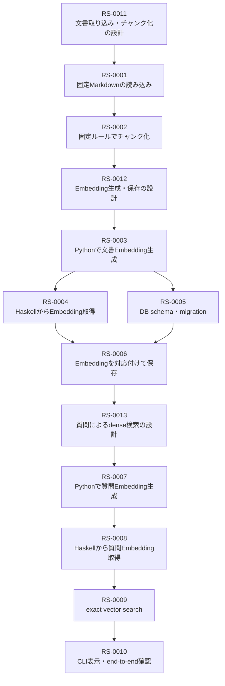
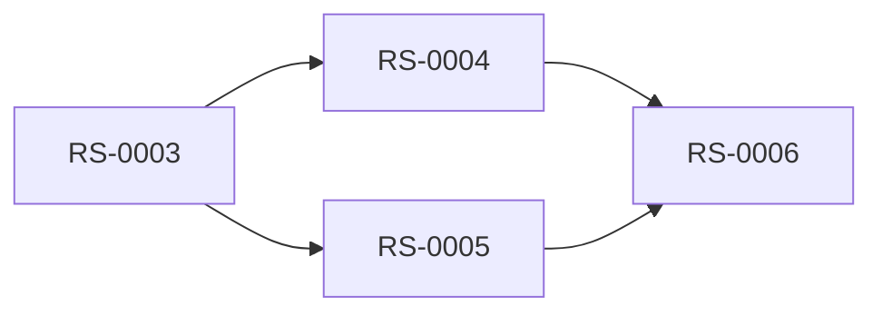

はい。現在の各Ticketの`前提`に従うと、**基本的にはEpic 1 → Epic 2 → Epic 3の順に、各Epic内では設計Ticketを先頭に進めます。**

## 推奨する作業順



番号で並べると、次の順です。

|順番|Ticket|
|--:|---|
|1|`RS-0011` 固定Markdown文書の取り込みとチャンク化を設計する|
|2|`RS-0001` 固定Markdownファイルを読み込む|
|3|`RS-0002` 固定ルールでMarkdown文書をチャンク化する|
|4|`RS-0012` 文書チャンクのEmbedding生成と保存を設計する|
|5|`RS-0003` Python AI Serviceで文書チャンクのEmbeddingを生成する|
|6|`RS-0004` Haskellから文書チャンクのEmbeddingを取得する|
|7|`RS-0005` PostgreSQLに文書チャンクとEmbeddingを保存するデータ構造を作成する|
|8|`RS-0006` 文書チャンクとEmbeddingを対応付けて保存する|
|9|`RS-0013` 質問によるdense検索を設計する|
|10|`RS-0007` Python AI Serviceで質問文のEmbeddingを生成する|
|11|`RS-0008` Haskellから質問文のEmbeddingを取得する|
|12|`RS-0009` PostgreSQLのpgvectorでexact vector searchを実行する|
|13|`RS-0010` Haskell CLIからdense検索を実行して結果を表示する|

## RS-0004とRS-0005だけは並行可能

厳密な依存関係では、RS-0004とRS-0005はどちらもRS-0003完了後に着手でき、互いには依存していません。



RS-0005は、RS-0003で実際のvector次元を確認できることを前提としています。  
RS-0004も、RS-0003で文書Embedding生成APIが完成していることを前提としています。  
そしてRS-0006は、RS-0004とRS-0005の両方を前提としています。

ただし今回は一人で進めるため、無理に並行させる意味はあまりありません。**Ticket番号どおりRS-0004 → RS-0005**でよいと思います。

## Epicごとのまとまり

### Epic 1

```text
RS-0011 → RS-0001 → RS-0002
```

RS-0001はRS-0011の文書処理設計を前提とし、RS-0002はRS-0011とRS-0001を前提にしています。

### Epic 2

```text
RS-0012 → RS-0003 → RS-0004 → RS-0005 → RS-0006
```

RS-0012は、Epic 1で文書チャンクを生成できる見通しと`文書処理設計.md`を前提にしています。

### Epic 3

```text
RS-0013 → RS-0007 → RS-0008 → RS-0009 → RS-0010
```

RS-0013は、Epic 2が完了して文書チャンクとEmbeddingを保存できることを前提としています。  
RS-0010は最後に、RS-0006、RS-0008、RS-0009をつなぎ、文書取り込みから検索結果表示までのend-to-end確認を行います。

> [!important]  
> 最初に着手するのは`RS-0001`ではなく、**`RS-0011`**です。  
> Ticket IDの大小ではなく、Ticket本文の`前提`とEpic間の依存関係に従います。

したがって、次の実作業は**RS-0011を`in_progress`にして、`docs/design/文書処理設計.md`の初版を作ること**になります。